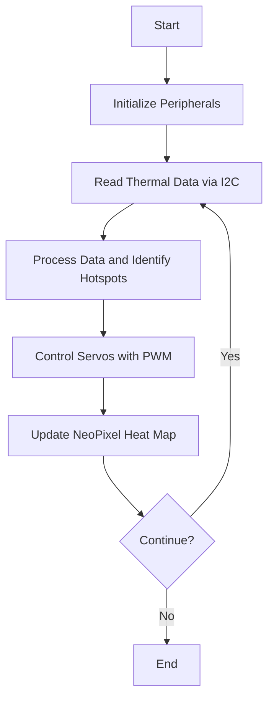

# Thermal-Camera-Robot
### Working Temperature Sensor Demo

A project to create a robotic system featuring a 2-servo pan-tilt arm with a thermal camera at the front. The main processing unit was a Pynq Z2 Developer Board, which provided easy integration with the PAN-TILT-HAT.

## Hardware Setup

- **PAN-TILT-HAT**: Enables the precise movement of the robotic arm to follow heat sources.
- **Pynq Z2 Developer Board**: The central processing unit responsible for managing peripherals and executing control logic.
- **AMG8833 Grid-Eye IR Sensor**: An 8x8 thermal sensor used for detecting heat sources.
- **8x8 NeoPixel Screen**: Displays the heat map detected by the thermal camera in real-time.

### Images

#### Pan-Tilt HAT

#### Pynq Z2 Developer Board

#### AMG8833 8X8 Grideye temperature sensor

## Block Design
The block design for this project integrates PWM generation for servo control, I2C communication for the AMG8833 sensor, and an AXI interface for the NeoPixel display.

### Block Design Image

## Software Overview

The control software was written in C and executed on the Pynq Z2. Below is a summary of the key components:

- **Servo Control**: Uses PWM signals to adjust the angles of the two servos for tracking heat sources.
- **I2C Communication**: Interfaces with the AMG8833 sensor to read thermal data.
- **NeoPixel Control**: Converts temperature data into colors and displays the heat map on the NeoPixel grid.
- **Tracking Algorithm**: Identifies the hottest points in the thermal image and adjusts servo angles to center the heat source in the camera’s field of view.

### Mermaid Diagram

## PWM Generation
PWM signals for the servos were generated using the following resource:
[PWM generation on the PynqZ2](https://blog.csdn.net/qq_41399144/article/details/130210318)

## Thermal Sensor Details

The AMG8833 Grid-Eye sensor outputs an 8x8 grid of temperature readings. These readings are processed to:

1. Detect hotspots.
2. Map temperatures to colors for display on the NeoPixel grid.
3. Calculate servo angles for tracking the heat source.

### Temperature to Color Mapping
Temperatures are mapped to colors to create a visually intuitive heat map:

- **< 10°C**: Green
- **10–20°C**: Gradient from green to orange
- **20–50°C**: Gradient from orange to red
- **> 50°C**: Bright red

### Key Code Functions

1. **Servo Initialization**: Configures and starts the PWM timers for servo control.
2. **I2C Initialization**: Sets up the I2C interface for communicating with the AMG8833.
3. **Temperature Reading**: Converts raw sensor data to Celsius.
4. **NeoPixel Update**: Maps temperature values to colors and updates the display.

